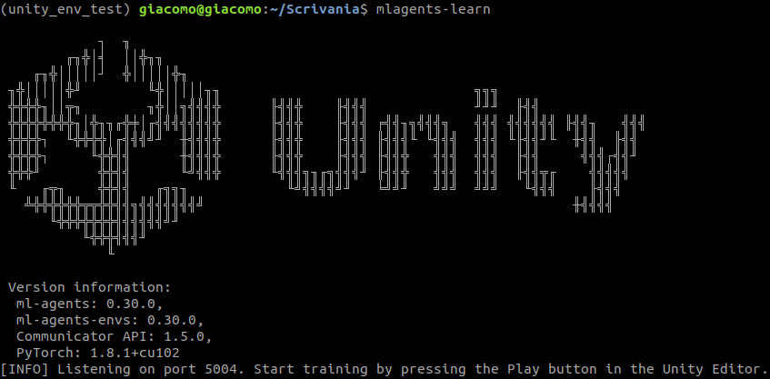
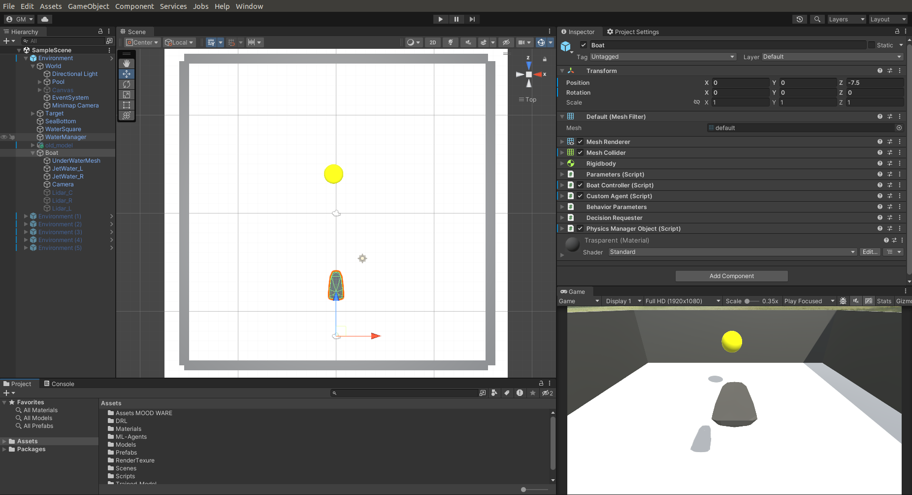
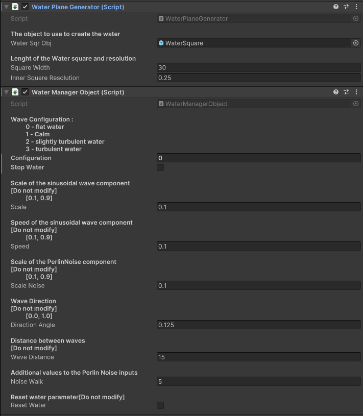
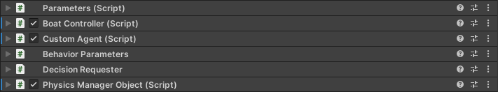
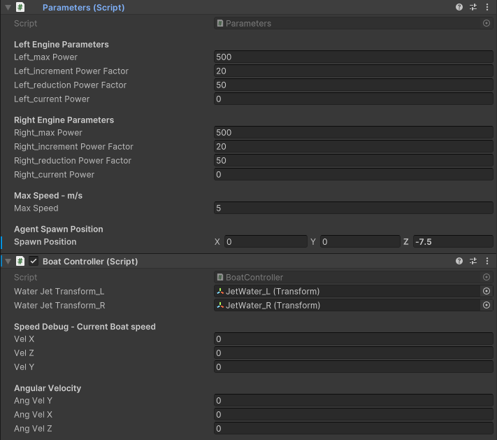

# AVS_Unity_Simulator

The content of this repository is the product of my thesis's work.
This project is intended to provide a unified framework to train an ASV agent in a simulated environment easily.

## Prerequisite

The operating system used is Ubuntu 18.04 LTS (It is highly suggested to upgrade to a later version). 
The use of GPU is highly suggested but optional.

It is assumed that Unity and Unity Hub are installed otherwise, follow the instructions on the [unity_page](https://unity.com/download).
Versions used:
- Unity: 2022.3.1f1
- Unity Hub: 3.7.0 

Anaconda is highly suggested to install all components.

## Installation of ML-Agents Release 20

### Install the mlagents Python package 

You can use the following steps to install the Python package of ML-Agents from the terminal.
For more information, see the documentation [here](https://github.com/Unity-Technologies/ml-agents/blob/release_20/docs/Installation.md#install-the-mlagents-python-package)


1. Create a conda environment
```
  conda create -n unity_env python=3.8
```
2. Activate the environment
```
  conda activate unity_env
```

> Note: for the next steps, you can refer to the ML-Agents documentation [doc_20]()

3. Install the pytorch version you required from [Pytorch](https://pytorch.org/get-started/locally/)
> Note: I used the CPU, make sure to select the conda installation.
```
  conda install pytorch torchvision torchaudio cpuonly -c pytorch
```
4. Install the **ML-Agents** toolkit, I used the **Release 20**
```
  pip install mlagents-envs==0.30.0
  pip install mlagents==0.30.0
```
> Note: test the installation by running the command ```mlagents-learn```
> If everything works correctly, you will see the following prompt.



> In my case, I needed to install the following packages

```
  pip install protobuf==3.20.1
  pip install six
```
### Install the com.unity.ml-agents Unity package
You need to make sure that the ml-agents Unity package for the Unity editor is installed in your project. For more details, see the documentation [here](https://github.com/Unity-Technologies/ml-agents/blob/release_20/docs/Installation.md#install-the-comunityml-agents-unity-package)

In the Unity editor on the menu bar, select:

1. Window -> Package Manager

In the menu bar of the Package Manager, select:

2. Packages: Unity Registry
 
Then, make sure the package "ML Agents" is installed and its version is 2.0.1 


<!-- comment
## Features



This is what the environment looks like.
In the hierarchy on the left, the principal components are:
- The world 
- The target
- The water manager
- The boat

The first two contain the structure of the environment.
Instead, the water manager and the boat are the objects that contain the C# script that defines the wave configuration and the interaction between the vessel and the water, respectively.

### Water manager scripts



The water manager contains two scripts.
The first one includes the variables that define the water plane's size and resolution.
Instead, the second script manages the parameters that modify the wave form.

### Boat scripts



-->

## Contributions

Before any push check the dimension of each file using the bash command explaind [here](https://netshopisp.medium.com/how-to-find-large-files-and-directories-in-linux-server-b176698d276f#:~:text=The%20%2Dtype%20f%20option%20specifies,details%20for%20each%20file%20found.)

The command to run is reported below:

```
  find . -type f -size +100M -exec ls -lh {} \; | awk '{ print $5 ": " $NF }' | sort -n -r
```
